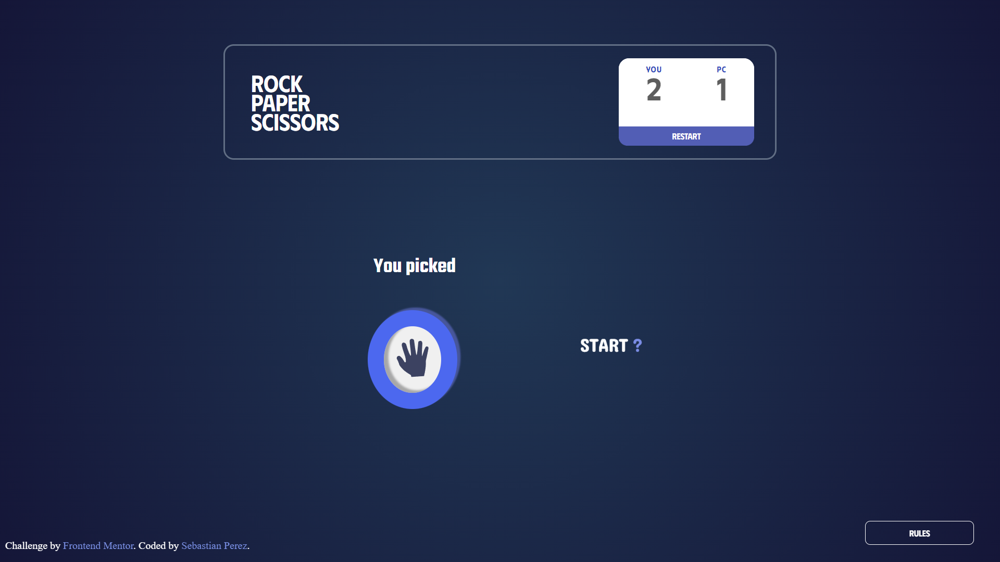
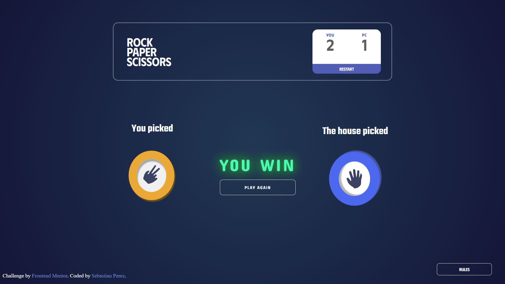
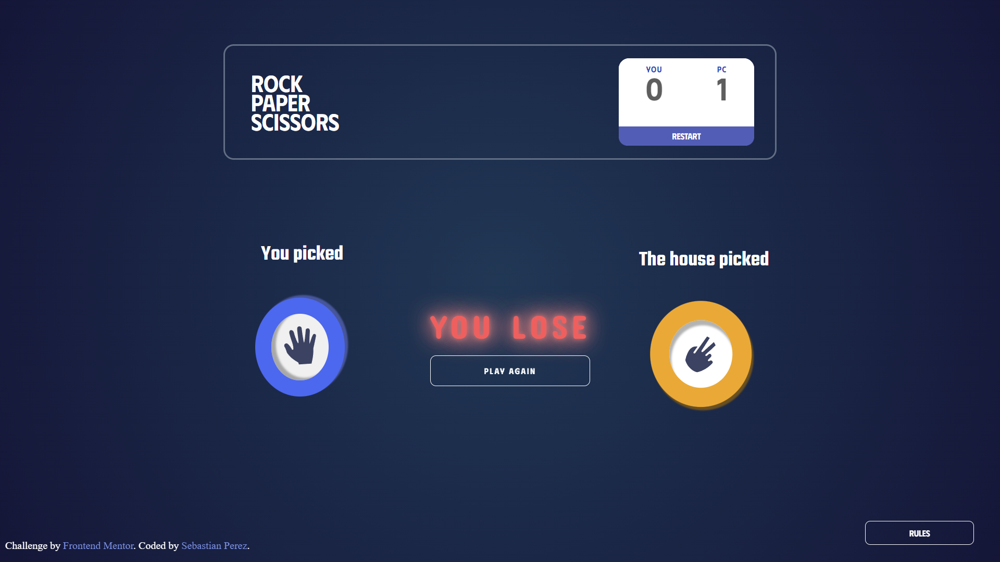
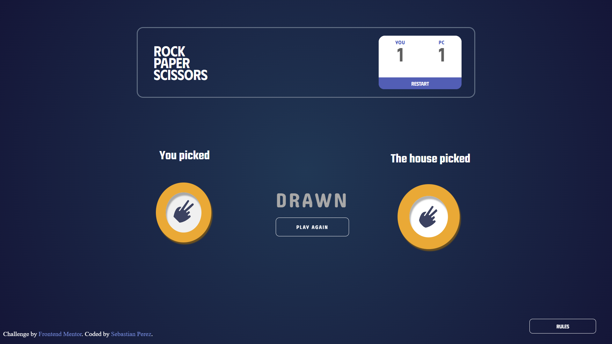

### EN 🌏

<h1 align=center><strong>"Rock Papper Scissors"</strong></h1>

## Proyect Design Preview

### Author

- Frontend Mentor / Profile - [@Sebastian Perez](https://www.frontendmentor.io/profile/SebaPerez90)
- Website - [@Frontend Mentor](https://www.frontendmentor.io/home)
- State : "**Finished**"

 

# The challenge :
**The Traditional Rock, Paper, Scissors Game**

Your challenge is to build out this Rock, Paper, Scissors game and get it looking as close to the design as possible.

You can use any tools you like to help you complete the challenge. So if you've got something you'd like to practice, feel free to give it a go.

 

#  Your users should be able to :

<strong>✔️ View the optimal layout for the game depending on their device's screen size</strong> 
<strong>✔️ Play Rock, Paper, Scissors against the computer</strong> 
<strong>✔️ Maintain the state of the score after refreshing the browser </strong> 
<strong>✔️ Reset the current global score</strong> 

|                            |                            |
|----------------------------|----------------------------|
|  |    |
|  |  |

Game Instances

## Stack :
<li><b>HTML</b></li>
<li><b>CSS</b></li>
<li><b>SASS</b></li>
<li><b>REACT</b></li>
<li><b>JAVASCRIPT</b></li>

 

## DEVELOPED BY :

Sebastian Perez - Frontend Developer

